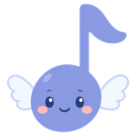

# おとは - Otoha Piano

> YouTube を見ながら弾く、ブラウザで開くだけのピアノ。



アンパンマンピアノ＋YouTube で親子が曲を練習している体験を、タブレットのブラウザで
再現します。「開けば使えるシリーズ」の一作。姉妹作：[いろは - Iroha Paint](https://github.com/uraraworks/IrohaPaint)。

名前の「おとは」は漢字で「音羽」。アイコンの羽つき音符キャラがそれです。

インストール不要・サーバー不要・API キー不要。動画のブックマークも練習の記録も、
すべて端末の中だけに保存されます。

- 公開先：https://uraraworks.github.io/OtohaPiano/
- 紹介ページ：https://uraraworks.github.io/OtohaPiano/intro.html （`public/intro.html`）
- 実装メモ・設計判断：[docs/v0-notes.md](docs/v0-notes.md)

**制作途中のプロトタイプ（v0）です。** 仕様も見た目も、まだ変わります。

## はじめかた

最初の一度だけ、大人が曲を登録します。

1. YouTube アプリで練習したい曲を開き、「共有」から URL をコピーする
2. おとはを開いて「曲」の欄に貼りつけ、「追加」を押す

あとは子どもがサムネイルを押すだけです。動画が再生され、画面の下の鍵盤で弾けます。
**検索の窓はあえて置いていません**（子どもが別の動画へ迷い込む入口を作らないため）。

共有 URL に `&t=90s` のような開始位置が入っていれば、登録時に「ここから練習」として
一緒に覚えます。

## 記録の置き場所とプライバシー

登録した曲・練習の位置・お手本・録音は、すべてその端末のブラウザの中に保存されます
（小さい JSON は localStorage、録音の音声データは IndexedDB）。**どこにも送信されません。**
このアプリにサーバーは存在せず、アカウントもありません。

外部へ出る通信は、動画の再生に使う YouTube の公式プレイヤー（IFrame Player API）と、
サムネイル（`img.youtube.com`）・タイトル（oEmbed）の取得だけです。いずれも API キーは
不要で、こちらから利用者の情報を渡すことはありません。再生中の通信と表示のきまりは
YouTube のものに従います。

マイクは録音ボタンを押したときにだけ使い、録音を止めた時点で必ず解放します
（マイク使用中の表示を残さないため）。マイクの無い端末では録音ボタンごと出しません。

ブラウザの履歴・サイトデータを消すと記録も消えます。

## 使い方（開発）

```bash
npm install
npm run dev      # http://localhost:5210 （LAN 公開。実機の iPad / Android から検証可）
npm test         # ロジックの単体テスト
npm run typecheck
npm run build    # dist/ に静的サイトを生成
```

`master` / `main` に push すると GitHub Actions が typecheck → test → build を通してから
GitHub Pages へ配置します（`.github/workflows/deploy.yml`）。`vite.config.ts` の
`base: "./"` により、リポジトリ名が変わっても配置先パスを直す必要はありません。

## v0 でできること

| | |
|---|---|
| 曲をえらぶ | YouTube の URL を貼るだけで登録。`youtu.be` 短縮形・`?si=` 付き・`watch?v=`・`shorts`・共有テキスト混じりのどれでも通る。サムネイル（`img.youtube.com`）とタイトル（oEmbed）は API キーなしで取得。子供はサムネイルをタップするだけ |
| 見ながら弾く | YouTube IFrame Player で**映像を必ず表示**して再生（音だけの再生は規約で不可。原体験も「見ながら弾く」なので一致）。シークバーと再生時間つき |
| くりかえし | A-B リピート。A を押して B を押すと、その区間を自動でループする。区間は動画ごとに端末へ保存され、次に開いたとき続きから練習できる |
| おそく弾く | 🐢0.5 / 🚶0.75 / 🏃1.0 の 3 段階。YouTube のスローはピッチを保つので、遅くしてもキー（音の高さ）は変わらない |
| ここを おぼえる | 「ここから練習」の位置を何個でも記録。動画ごとに保存され、タップでその位置へ飛ぶ。共有 URL に `&t=90s` が入っていれば、登録時にそれを最初のマーカーとして引き継ぐ |
| 弾く | 画面下の鍵盤。ピアノ / エレクトーン / オルゴール / ストリングスの 4 音色。マルチタッチ（和音・連打）対応。指を滑らせるとグリッサンドになる。鍵盤の広さは 3 段階、オクターブは左右ボタンで移動 |
| おてほん（光る鍵盤） | 上手な人がこの鍵盤で弾くと、打鍵（鍵・タイミング・長さ）だけを MIDI と同じ考え方で記録する。数 KB。再生すると音が鳴り、押すべき鍵が光る。**動画を再生しながら録ると動画の時刻に紐づき、シーク・A-B リピート・速度変更のすべてに自動で追従する**。音あり／光だけ／音だけを切り替え可 |
| おてほん（音声メモ） | マイクで録音して端末内に保存。本物のピアノ・先生・友達の演奏など、アプリの外の音を残せる。再生はピッチを保ったまま速度変更できる。**マイクの無い端末では録音ボタンごと出さない** |
| 流れるドレミ | 打鍵記録から音名の列を作り、再生位置に合わせてカラオケ字幕式に光らせる。ほぼ同時の打鍵は「ドミソ」のように和音でまとめる。印刷にも対応（🖨 ボタン） |
| おとあて | **音と音名（ドレミ）の対応を覚えるドリル。**タイピング練習と同じで、やめるまで出題が続く。おだいの出しかたは 💡ひかる（位置）→ 🔤もじ（音名→鍵）→ 👂おと（音→鍵）→ 🎼おんぷ（五線→鍵）の 4 通りで、ヒントを 1 段ずつ外していける。やりかたは「♾ずっと」と「💥1つでも まちがえたら おわり」の 2 つ。正解のあとは少し間が空く。範囲は ドレミ／ドレミファソ／1 オクターブ／和音入りの 4 つ。最高記録が残る |
| 全画面 | ヘッダー右の ⛶ で全画面。**iPhone の Safari は `<video>` 以外の全画面 API を持たない**（呼んでも例外すら出ずに何も起きない）ので、対応環境でだけボタンを出す。Android・iPad・PC では出る |
| メトロノーム | BPM 30〜240、拍子 2/3/4、拍ランプ。タップテンポ（叩いた間隔から BPM を自動計測）。Web Audio の先読みスケジューリングで、他の処理が詰まっても拍がよれない |

UI は漢字＋ふりがな（HTML 標準の `<ruby>`）。文言は大人向けの普通の言葉遣いで、
主要ボタンにはアイコンを併記しています（🐢🚶🏃 など）。大人・小学生・幼児を 1 つの UI で
カバーする狙いです。

## 設計上の判断

- **音源解析（音声 → 音階の自動変換）は入れていない。** `basic-pitch` などで技術的には
  可能でも、バンド曲では楽器を判別できず混在した MIDI になる。確実性が保証できないものを
  v0 の柱にしない、という判断。代わりに「人が弾いた打鍵を記録する」方式でお手本を実現した。
  この方式は音階が 100% 正しいので、流れるドレミも推定なしで出せる（副産物）。
- **鍵盤の音はサンプル音源ではなく Web Audio の合成音**（[src/core/synth.ts](src/core/synth.ts)）。
  サウンドフォントは数 MB の外部ファイルとライセンス確認が必要で、「完全静的・権利問題なし」
  という柱と噛み合わない。プロトタイプの目的は手触りの確認なので、まず合成音で通した。
  差し替えるときは `noteOn` / `noteOff` の形を保ったまま中身だけ替えればよい。
- **お手本の再生は自前の時計を持たない**（[src/core/takePlayback.ts](src/core/takePlayback.ts)）。
  動画に紐づく記録は「今の動画時刻」を毎 tick 渡してもらうだけにしてある。追従のための
  コードを書かずに、シーク・ループ・速度変更への追従が成立する。
- **弾き方には踏み込まない。** 作っているのは資格を持つ人ではないので、運指・手の形・姿勢に
  踏み込むと妙なクセを付けかねない。そこは人から教わるのがよい。一方「この音は ド」
  「ド はこの鍵」という対応は、誰から習っても同じ事実で、間違った癖の付きようがない。
  ドリルが扱うのはそこだけ。**教則の順序を組む（＝効果の裏付けが要る）ことも避けている。**
- **ドリルは曲を持たず、規則から出題を作る。** 曲は誰かの作品なので、自分で弾いた打鍵記録で
  あっても楽曲そのものの権利が残る。`src/core/drills.ts` は音の並びをその場で組み立てるので、
  **権利の判断そのものが発生しない。** 範囲・長さ・出題の中身が引数で変わるのは、その副産物。
- **待ちながら進む形にして、時計を持たせない。** テンポに追われると初心者は続かない。
  速く弾く練習は既存の速度 3 段階とメトロノームが受け持つ、と役割を分けてある。
- **おだいは 4 通りでヒントを外していける。** 光は位置を教えるだけで音名を覚えないので、
  いちばん下の段としてだけ置き、もじ（音名 → 鍵）→ おと（音 → 鍵）→ おんぷ（五線 → 鍵）と
  上がれるようにした。五線の音部記号は鍵盤の左端に合わせて選ぶので（`src/core/staff.ts`）、
  オクターブを動かしても加線は 2 本までに収まる。
- **音部記号は SVG で描く。** Unicode の音楽記号（𝄞）は端末にフォントが無いと豆腐になり、
  記号用フォントを読み込むのは「完全静的・外部依存なし」に反する。渦はベジエで手合わせせず
  計算で描いている（手で合わせたら、渦の中心がソの線に乗らず記号として意味をなさなかった）。
- **正解したら少し間を置いてから次を出す。** 間が無いと、押した音と次のおだいの音が重なって
  聞き分けられない。この間の打鍵は判定しない（まだ出ていないおだいを間違い扱いにしないため）。
- **色はやさしい明るめ。** 地はほんのり紫がかった白で、アイコンのキャラのラベンダーと
  地続きにしてある。色は `:root` のトークンだけで決め、以降のルールに生の色は書かない
  （テーマを差し替えるとき探し回らずに済むように）。薄い色（ふりがな・鍵盤のドレミ・
  ボタンの副ラベル）は地に対して 4.5:1 以上を確保してある。明るい地は暗い地より濃く
  しないと足りない。
- **ヘッダーとファビコンのアイコンは背景透過。** キャラの外接矩形で切り直してから縮小し、
  小さいサイズでもキャラが大きく出るようにしている。`apple-touch-icon` と maskable だけは
  不透明（iOS のホーム画面は透過を黒く落とすため）。
- **鍵盤に書く音名はドレミだけ。** 今どのオクターブにいるかは道具バーの表示（C4 など）で
  分かるので、鍵盤の上で日本語音名と英語音名を混ぜない。
- **保存先は 2 つだけ。** 小さい JSON（ライブラリ・打鍵記録）は localStorage、
  音声メモの Blob は IndexedDB。キーに版番号を含め、将来データの形を変えたときに
  古い形を読んで壊れないようにしてある。

## 構成

```
src/core/    判断のあるロジック（DOM に触らない。テストはここに寄せている）
src/ui/      鍵盤などの描画
src/main.ts  画面の組み立てと配線
test/        単体テスト
```

## 公開の手順

1. GitHub に `uraraworks/OtohaPiano` を作る（public）
2. `git remote add origin https://github.com/uraraworks/OtohaPiano.git` して push
3. リポジトリの Settings → Pages で Source を **GitHub Actions** にする

`master` / `main` への push で `.github/workflows/deploy.yml` が typecheck → test → build を
通してから Pages へ配置します。`base: "./"` なのでリポジトリ名を後から変えても
配置先パスを直す必要はありません。

## ライセンス

MIT（[LICENSE](LICENSE)）。学校・先生・他の開発者がためらわずに使えることを優先しました。
姉妹作の[いろは](https://github.com/uraraworks/IrohaPaint)と同じ判断です。

アイコン画像（`public/icon/`）は URARA-works の著作物です。
このアプリは YouTube の公式プレイヤーを埋め込んで再生するだけで、動画そのものを
複製・保存・再配布しません。再生される動画の権利はそれぞれの権利者に帰属します。
